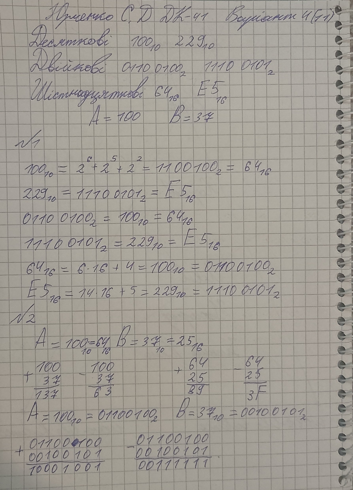
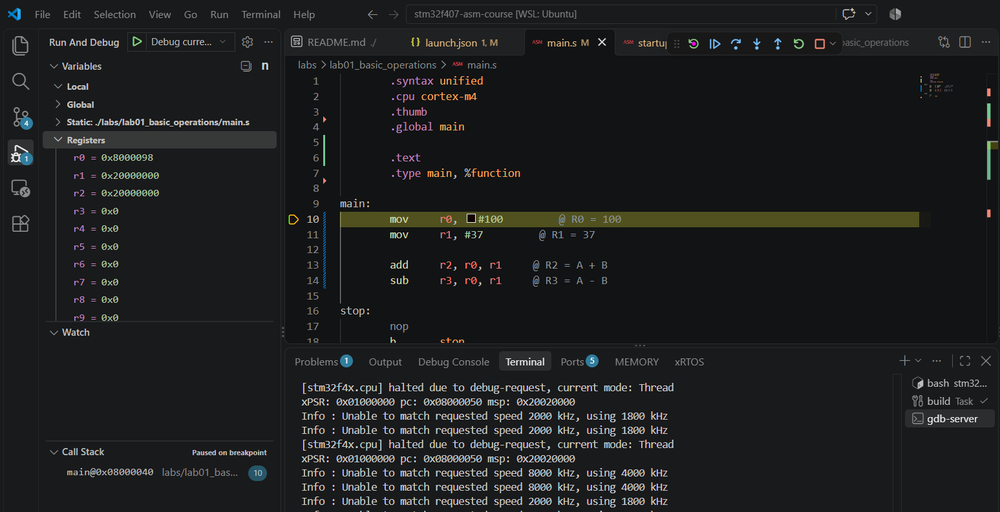
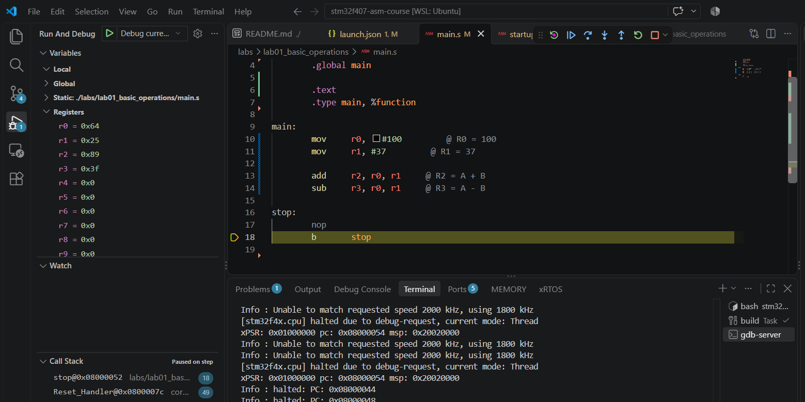

# Practical Work 1 — Number Systems and First ARM Assembly Instructions

Work in `labs/lab01_basic_operations/` on branch `lab01` in your personal
course fork. Before starting, follow the
[student workflow](../../docs/student-workflow.md) to set up instructor review.
Build from the repository root using
`make PROJECT=labs/lab01_basic_operations`, then follow the course debugging
instructions.

## Topic

**Binary, decimal, hexadecimal numbers and first ARM Assembly instructions: `MOV`, `ADD`, `SUB`.**

## Goal

After this practical work, you should be able to:

- convert numbers between decimal, binary, and hexadecimal manually;
- write simple ARM Assembly code using `MOV`, `ADD`, and `SUB`;
- load values into ARM registers;
- check register values in Cortex-Debug;
- perform addition and subtraction manually in column form and compare the result with the debugger.

---

## Important Rules

1. Do the number conversions **manually**.
2. Show your work.
3. Do not use online converters for the main task.
4. Use the debugger only to **check** your result.
5. All numbers in this practical work are **unsigned**.
6. For binary column calculations, use at least **8 bits**.

---

## Short Reminder

### Decimal to binary

Example:

```text
42₁₀ = 32 + 8 + 2 = 101010₂
```

### Binary to decimal

Example:

```text
101010₂ = 1×32 + 0×16 + 1×8 + 0×4 + 1×2 + 0×1 = 42₁₀
```

### Decimal to hexadecimal

Example:

```text
42₁₀ = 2A₁₆
```

### Hexadecimal to decimal

Example:

```text
2A₁₆ = 2×16 + 10 = 42₁₀
```

---

## ARM Assembly Examples

### Example 1 — `MOV`

```asm
        .syntax unified
        .cpu cortex-m4
        .thumb
        .global main

        .text

main:
        mov     r0, #42        @ R0 = 42
        mov     r1, #5         @ R1 = 5

stop:
        nop
        b       stop
```

Check in Cortex-Debug:

```text
R0 = 42
R1 = 5
```

---

### Example 2 — `ADD` and `SUB`

```asm
        .syntax unified
        .cpu cortex-m4
        .thumb
        .global main

        .text

main:
        mov     r0, #10        @ R0 = 10
        mov     r1, #3         @ R1 = 3

        add     r2, r0, r1     @ R2 = R0 + R1 = 13
        sub     r3, r0, r1     @ R3 = R0 - R1 = 7

stop:
        nop
        b       stop
```

Check in Cortex-Debug:

```text
R0 = 10
R1 = 3
R2 = 13
R3 = 7
```

---

## What You Must Submit

For your variant, submit:

1. Manual conversions.
2. Manual addition and subtraction in column form.
3. Your ARM Assembly source code.
4. A screenshot from Cortex-Debug showing the register values.
5. A short conclusion: whether your manual results match the register values.

Place your code in `main.s`. Append a **Student report** section to this
`README.md` with your name, GitHub username, variant number, manual work,
completed register table, and conclusion. Keep the original tasks and variant
tables. Create `screenshots/` inside this lab directory, save your register
screenshot as `screenshots/debug_registers.png`, and reference it in your report.

Submit a PR from `lab01` to `master` **in your own fork**, following the
[student workflow](../../docs/student-workflow.md). Send the instructor the PR
URL; if a classroom platform or LMS is used, submit that same URL there.
Address feedback on the same branch and merge only after `@ant112342` approves
the current work. A push or merge alone does not count as lab acceptance.

Do not commit `build/` or generated `.o`, `.elf`, `.bin`, or `.map` files.

---

# Task 1 — Manual Number Conversion

For your variant, convert all numbers to the required number systems.

For each decimal number, write:

```text
N₁₀ = ______₂ = ______₁₆
```

For each binary number, write:

```text
N₂ = ______₁₀ = ______₁₆
```

For each hexadecimal number, write:

```text
N₁₆ = ______₁₀ = ______₂
```

---

## Variants

### Variant 1

| Task | Number |
|---|---|
| Decimal numbers | 42₁₀, 63₁₀ |
| Binary numbers | 101010₂, 11110000₂ |
| Hexadecimal numbers | 2A₁₆, A5₁₆ |
| Assembly values | A = 42, B = 15 |

### Variant 2

| Task | Number |
|---|---|
| Decimal numbers | 14₁₀, 52₁₀ |
| Binary numbers | 1110₂, 100100₂ |
| Hexadecimal numbers | 0E₁₆, 7C₁₆ |
| Assembly values | A = 52, B = 18 |

### Variant 3

| Task | Number |
|---|---|
| Decimal numbers | 85₁₀, 127₁₀ |
| Binary numbers | 01010101₂, 01111111₂ |
| Hexadecimal numbers | 55₁₆, 3B₁₆ |
| Assembly values | A = 85, B = 27 |

### Variant 4

| Task | Number |
|---|---|
| Decimal numbers | 100₁₀, 229₁₀ |
| Binary numbers | 01100100₂, 11100101₂ |
| Hexadecimal numbers | 64₁₆, E5₁₆ |
| Assembly values | A = 100, B = 37 |

### Variant 5

| Task | Number |
|---|---|
| Decimal numbers | 36₁₀, 215₁₀ |
| Binary numbers | 00100100₂, 11010111₂ |
| Hexadecimal numbers | 24₁₆, D7₁₆ |
| Assembly values | A = 96, B = 28 |

### Variant 6

| Task | Number |
|---|---|
| Decimal numbers | 78₁₀, 165₁₀ |
| Binary numbers | 01001110₂, 10100101₂ |
| Hexadecimal numbers | 4E₁₆, A5₁₆ |
| Assembly values | A = 78, B = 23 |

### Variant 7

| Task | Number |
|---|---|
| Decimal numbers | 240₁₀, 255₁₀ |
| Binary numbers | 11110000₂, 11111111₂ |
| Hexadecimal numbers | F0₁₆, FF₁₆ |
| Assembly values | A = 120, B = 45 |

---

# Task 2 — Manual Addition and Subtraction

Use your assembly values:

```text
A = ______
B = ______
```

Calculate manually:

```text
A + B = ______
A - B = ______
```

Show both operations in column form.

## Decimal column form

```text
     A
+    B
------
   A+B
```

```text
     A
-    B
------
   A-B
```

## Binary column form

Use at least 8 bits.

Example:

```text
  00101010
+ 00001111
----------
  00111001
```

```text
  00101010
- 00001111
----------
  00011011
```

## Hexadecimal column form

Example:

```text
  2A
+ 0F
----
  39
```

```text
  2A
- 0F
----
  1B
```

---

# Task 3 — ARM Assembly Program

Write an ARM Assembly program for your variant.

Use:

```text
R0 = A
R1 = B
R2 = A + B
R3 = A - B
```

Use this template:

```asm
        .syntax unified
        .cpu cortex-m4
        .thumb
        .global main

        .text

main:
        mov     r0, #A         @ R0 = A
        mov     r1, #B         @ R1 = B

        add     r2, r0, r1     @ R2 = A + B
        sub     r3, r0, r1     @ R3 = A - B

stop:
        nop
        b       stop
```

Replace `A` and `B` with the numbers from your variant.

Example:

```asm
        mov     r0, #42
        mov     r1, #15

        add     r2, r0, r1
        sub     r3, r0, r1
```

---

# Task 4 — Debugging

Run your program and check the registers in Cortex-Debug.

Fill in the table:

| Register | Meaning | Expected value | Debugger value |
|---|---|---:|---:|
| R0 | A |  |  |
| R1 | B |  |  |
| R2 | A + B |  |  |
| R3 | A - B |  |  |

---

# Task 5 — Short Conclusion

Write 2–3 sentences.

Example:

```text
The values in registers R0 and R1 match the input numbers from my variant.
The values in R2 and R3 match my manual addition and subtraction results.
Therefore, the ARM Assembly program works correctly.
```

---

## Optional Question

What happens if `A - B` becomes negative in unsigned arithmetic?

Write your answer in 1–2 sentences.

# Student report

11. Yurchenko Serhii      DK-41   @yurchenkoserhiidk-41   Variant number 4

## Manual work:



## Table:

| Register | Meaning | Expected value | Debugger value |
|---|---|---:|---:|
| R0 | A | 0x64 | 0x64 |
| R1 | B | 0x25 | 0x25 |
| R2 | A + B | 0x89 | 0x89 |
| R3 | A - B | 0x3F | 0x3F |

## Start register table:



## Completed register table:



## Conclusion

I have an STM32F411, in the STM32F407.svd file there is data from https://raw.githubusercontent.com/cmsis-svd/cmsis-svd-data/main/data/STMicro/STM32F411.svd.

The values in registers R0 and R1 match the input numbers from my variant.
The values in R2 and R3 match my manual addition and subtraction results.
Therefore, the ARM Assembly program works correctly.

If the number A - B becomes negative in unsigned arithmetic, an underflow will occur.